# Architektur

Alexander --> Architekturdiagramm

## Timetable-Service

Lukas

## Booking-Service

Alexander

# Quarkus

[Quarkus](https://quarkus.io/) ist ein Framework zur Erstellung von Anwendungen auf der JVM, die in Container-Umgebungen eingesetzt werden.
Mit Quarkus erstellte Anwendungen zeichnen sich durch einen schnellen Applikationsstart und geringen Arbeitsspeicherverbrauch aus.
Zusätzlich können bei der Verwendung von GraalVM native Binaries der Anwendungen erzeugt werden, welche sich durch noch geringere Startzeiten und Ressourcenverbrauch auszeichnen.
Darüber hinaus ist Quarkus für eine gute Zusammenarbeit mit der Containerplattform Kubernetes optimiert.

Da die von GraalVM für native Binaries verwendete SubstrateVM noch nicht alle Features der JVM unterstützt und insbesondere mit Reflection Probleme bereitet, vermeidet Quarkus den Einsatz von Reflection und bietet eine Möglichkeit, bei Applikationsstart nicht unterstütze Elemente als Warnungen anzuzeigen.

Quarkus ist mit einer Vielzahl von Java-Libraries und Frameworks, darunter Eclipse MicorProfile in der aktuellsten Version 3.3, kompatibel.
Ebenfalls bietet Quarkus Unterstütztung für Basistechnologien, die für Webanwendungen benötigt werden, wie z.B. JDBC, JPA und JTA.
Zusätzlich werden noch reaktive Programmierkonzepte, wie z.B. die APIs von Eclipse Vert.x, unterstützt.

Quarkus bietet ebenfalls einen sehr guten [Projektgenerator](https://code.quarkus.io/), mit welchem die Dependencies auf einfache Art und Weise ausgewählt werden können.
Diesen haben wir auch für unsere Implementierung genutzt.

## Unsere Erfahrungen

Durch die Verwendung des Projektgenerators, die gute Dokumentation bereitete Quarkus während der Implementierung kaum Probleme.
Positiv anzumerken ist, dass wir einen GitHub-Issue erstellt haben, welcher sehr schnell vom Entwicklerteam beantwortet wurde.

Ursprünglich wollten wir die Implementierung des Timetable-Services mit [Thorntail](https://thorntail.io/) durchführen.
Allerdings wird Thorntail laut [einem Blogpost](https://thorntail.io/posts/thorntail-community-announcement-on-quarkus/) nicht mehr mit voller Teamstärke weiterentwickelt und die Zukunft liegt in Quarkus.
Dies ist allerdings auf der Thorntail-Projektseite mit Stand April 2020 nur schwer ersichtlich.

## Automatisierte Tests

Quarkus hat eine herausragende Unterstützung für automatisierte Tests auf mehreren Stufen:

- Mittels Rest-Easy können einfach Integrationstests der REST-Endpunkte durchgeführt werden, wobei das zurückgelieferte JSON-Dokument von der Test-Suite inspiziert werden muss.
- Da auch im Testmodus Dependency-Injection via CDI vollständig unterstützt wird, können Integrationstests über mehrere Schichten des Systems durchgeführt werden. Die Unterstützung geht sogar so weit, dass z.B. Annotationen der JTA wie `@Transactional` unterstützt werden.
- Natürlich können über die mitgelieferte Bibliothekt JUnit 5 auch Unit-Tests durchgeführt werden.

Wir haben uns für den Timetable-Service auf Integrationstests der Geschäftslogik festgelegt, da wir somit die volle Funktionalität der Bibliothek JUnit auf Java-Objekten ausnutzen können, was insbesondere gegenüber Tests der REST-Controller erhebliche Vorteile bietet.
So ist es wesentlich einfacher die Inhalte einer Java-Collection zu prüfen als ein JSON-Dokument.
Außerdem sind unsere REST-Controller lediglich sehr dünne Wrapper um die Geschäftslogik und durch Tests der Geschäftslogik werden bereits weite Teile des Systems automatisch getestet.

### Ergebnisse

Die Tests werden in dem Standard-Ordner von Maven (`src/test/java`) abgelegt.
Als Beispiel folgt unten ein Auszug aus unserer Testsuite für das Suchen von Verbindungen zwischen zwei Bahnhöfen.
Die Testmethode `testFindRouteWithConnection` sucht eine Verbindung zwischen Berlin und Zürich und überprüft, ob eine Verbindung zurückgegeben wird und ob diese über die gewünschte anzahl von Zwischenhalten verfügt.
Die Testmethode `testFindRouteForNonExistingStop` stellt sicher, dass eine entsprechende Exception ausgelöst wird, wenn es keine Verbindung zwischen zwei Bahnhöfen gibt.

```java
@QuarkusTest
public class RouteManagerTest {
    @Inject
    private RouteManager routeManager;

    @Test
    public void testFindRouteWithConnection() throws NoRouteException {
        var connections = this.routeManager.findAllStopsBetween(43L, 14L);
        assertNotNull(connections);
        assertTrue(connections.size() > 0);
        assertEquals(29, connections.size());
    }

    @Test
    public void testFindRouteForNonExistingStop() {
        assertThrows(
                NoRouteException.class,
                () -> this.routeManager.findAllStopsBetween(0L, -1L)
        );
    }
}
```

Das Ausführen der Tests funktioniert, wie gewohnt, über das Maven-Goal `test`.
Unten folgt noch ein Auszug aus dem Testprotokoll, welches die Ausführung des zuvor genannten Maven-Goals ergibt.

```
[INFO] Tests run: 3, Failures: 0, Errors: 0, Skipped: 0, Time elapsed: 7.104 s - in eu.nighttrains.timetable.test.RailwayStationManagerTest
[INFO] Running eu.nighttrains.timetable.test.RouteManagerTest
[INFO] Tests run: 5, Failures: 0, Errors: 0, Skipped: 0, Time elapsed: 0.117 s - in eu.nighttrains.timetable.test.RouteManagerTest
[INFO] Running eu.nighttrains.timetable.test.TrainConnectionManagerTest
[INFO] Tests run: 6, Failures: 0, Errors: 0, Skipped: 0, Time elapsed: 0.079 s - in eu.nighttrains.timetable.test.TrainConnectionManagerTest
17:42:19 INFO  traceId=, spanId=, sampled= [io.quarkus] (main) Quarkus stopped in 0.039s
[INFO] 
[INFO] Results:
[INFO] 
[INFO] Tests run: 14, Failures: 0, Errors: 0, Skipped: 0
[INFO] 
[INFO] ------------------------------------------------------------------------
[INFO] BUILD SUCCESS
[INFO] ------------------------------------------------------------------------
[INFO] Total time:  12.016 s
[INFO] Finished at: 2020-04-10T17:42:19+02:00
[INFO] ------------------------------------------------------------------------
```

# Wildfly mit Microprofile

Alexander

# OpenLiberty

Der Booking-Service sollte ursprünglich mit [IBM OpenLiberty](https://www.openliberty.io/) entwickelt werden.
Wir haben uns aufgrund der [sehr guten und einsteigerfreundlichen Dokumentation](https://www.openliberty.io/guides/) von OpenLiberty hierzu entschieden.
Die Dokumentationsbeispiele liesen sich auch sehr gut auf unser Projekt übertragen, allerdings standen wir schnell vor dem Problem, dass wir beide es trotz mehrstündiger Bemühungen nicht schafften, den JDBC-Treiber für PostgreSQL und die JTA-Data-Source im System zu registrieren.
Wir haben dabei [eine](https://blog.sebastian-daschner.com/entries/openliberty-with-postgres) [Vielzahl](https://openliberty.io/blog/2019/07/18/microprofile-30-developer-experience.html#postgresql) [von](https://blog.sebastian-daschner.com/entries/openliberty-override-configuration) [Diskussionsbeiträgen](https://stackoverflow.com/questions/59368683/how-to-add-postgresql-driver-jar-to-open-liberty-microprofile-fat-jar-created) probiert und keine Lösung hat funktioniert.

Nichtsdestotrotz konnten wir aus den Tutorials viel wertvolles Wissen über die MicroProfile-APIs gewinnen und aufgrund der Standardisierung sehr gut auf Quarkus und Wildfly übertragen.

# MicroProfile Config

## Beschreibung

MicroProfile Config ist ein API, welches den Zugriff auf die Konfiguration einer Anwendung mittels Dependency-Injection ermöglicht.
Dabei baut MicroProfile Config auf CDI auf.
Darüber hinaus ist MicroProfile Config in der Lage, Konfigurationsparameter aus mehreren Quellen zu vereinigen und der Anwendung über ein einheitliches API zur Verfügung zu stellen.
Jeder Konfigurationsquelle wird dabei eine Priorität zugewiesen und im Falle, dass zwei Konfigurationsparameter über den selben Schlüssel angesprochen werden, wird dem Wert aus der Quelle mit der höchten Priorität Vorrang gegeben.
Neben den vom Applikationsserver standardmäßig bereitgestellten Konfigurationsquellen können natürlich selbstimplementierte Quellen hinzugefügt werden.
Unser Projekt verwendet beispielsweise Werte aus einer Redis-Key-Value-Datenbank.

## Verwendung in Services

Das Booking-Service verwendet MicroProfile, um die Basis-URL des Timetable-Services aus der Konfiguration zu laden.

Quarkus hat eine ausgezeichnete Unterstützung für MicroProfile Config und wir haben eines unserer Experimente so ausgebaut, dass die gesamte Konfiguration für Quarkus über das Config-API geladen wurde.

Wie bereits zuvor erwähnt, haben wir auch eine selbstimplementierte Konfigurationsquelle implementiert, welche auf die in einem Redis-Key-Value-Store gespeicherte Konfiguration zugreift.
Dies bietet den Vorteil, dass mittels Value-Providern die Konfigurationswerte sich zur Laufzeit des Programms ändern können.

## Implementierung

### Zugriff auf Konfigurationsparameter

Der Zugriff auf Konfigurationsparameter ist über den im MicroProfile enthaltenen CDI-Mechanismus am einfachsten und elegantesten möglich, wie der folgende Quellcodeauszug zeigt:

```java
@Inject @ConfigProperty(name = "timetableService", defaultValue="http://127.0.0.1:8080") 
private String timetableServiceUrl;
```

`@Inject` gibt an, dass der Wert über CDI injiziert wird und `@ConfigProperty`, dass dieser über MicroProfile Config ermittelt wird.
Der Annotationsparameter `name` gibt den Schlüssel des Konfigurationsparameter an und der optionale Annotationsparameter `defaultValue` gibt einen Standardwert an, falls der Schlüssel in keiner Konfiguration gefunden wird.

MicroProfile Config ist ein Basis-API, auf das andere MicroProfile-APIs aufbauen.
So kann z.B. bei der Verwendung von MicroProfile Rest Client die URL des aufgerufenen Service aus der Konfiguration geladen werden.
Hierzu ist einfach der Schlüssel des Konfigurationsparameters mit der URL des REST-Endpunkts bei der als Parameter `configKey` der Annotation zur Registrierung des REST-Clients anzugeben.
Dies ist unter anderem im unten zu sehenden Beispiel gegeben:

```java
@RegisterRestClient(configKey = "timetableService")
```

### Benutzerdefinierte Konfigurationsquelle

Um eine benutzerdefinierte Konfigurationsquelle zu erstellen, sind zwei Schritte notwendig:

1. Implementierung der Konfigurationsquelle
2. Registrierung der Konfigurationsquelle als Service-Provider

Die Programmierung einer Konfigurationsquelle erfolgt durch Erstellung einer Klasse, welche das Interface `org.eclipse.microprofile.config.spi.ConfigSource` implementiert.

Das Interface `ConfigSource` definiert die Methoden `getProperties`, `getPropertyNames`, `getValue`, `getName` und `getOrdinal`.

Die Methode `getProperties` liefert eine Map, welche die Schlüssel auf die Werte abbildet zurück.
Die Properties unserer Services haben wir als Member eines Hashes in Redis modelliert.
Der Name des Hashes entspricht dabei dem Namen des Services, also entweder `booking ` oder `timetable`.
Die Implementierung der Methode `getProperties` ermittelt zuerst mittels des Kommandos `HKEYS` die Schlüssel aller Werte des Hashes, erstellt eine Map, welche das Ergebnis repräsentiert und fragt anschließend mittels `HGET` den Wert für jeden Schlüssel ab.

Die Implementierung der Methode `getPropertyNames` liefert einfach das Ergebnis der Abfrage `HKEYS` zurück.

Zur Abfrage einzelner Properties dient die Implementierung der Methode `getValue`.
Diese gibt das Ergebnis der Abfrage `HGET` zurück.

Für `HKEYS` und `HGET` wird dabei jeweils der Name des Hashes benötigt.
Diesen lädt die Konfigurationsdatei über eine weitere Konfigurationsdatei im JSON-Format zum Start der Applikation.
Die JSON-Datei muss den Namen `redisConfiguration.json` haben und sich in der Wurzel des Ressourcenverzeichnisses befinden.
Neben dem Präfix (entweder `booking` oder `timetable`) enthält diese Datei noch die Konfiguration zum Zugriff auf Redis.
Zum Parsen der Datei wird JSON-P verwendet.
Der folgende Auszug zeigt die Konfigurationsdatei für den Timetable-Service:

```json
{
  "hostname": "127.0.0.1",
  "port": 6379,
  "timeout": 3000,
  "maximumPoolSize": 5,

  "prefix": "timetable"
}
```

Um die benutzerdefinierte Konfigurationsquelle als Service zu registrieren, ist der vollständig qualifizierte Name der Klasse in der Datei `org.eclipse.microprofile.config.spi.ConfigSource` im Verzeichnis `src/main/resources/META-INF/services` anzugeben.
Für die von uns definierte Datei hat die Konfiguration den folgenden Inhalt:

```
eu.nighttrains.configuration.redis.RedisConfigurationSource
```

## Ergebnisse

Wie bereits erwähnt, wird sowohl die URL des Timetable-REST-Endpunkts im Booking-Service als auch die gesamte Konfiguration des Quarkus-basierten Timetable-Services aus einer Redis-KV-Datenbank geladen.
Leider bietet MicroProfile Config nicht sehr viele visuelle Möglichkeiten, es ist aber eine wichtige Basistechnologie für andere MicroProfile-APIs.

Interessant ist noch die Ausführung des Kommandos `CLIENT LIST` auf der Redis CLI, nachdem die Server gestartet wurden.
Wie im folgenden Ausgabeauszu ersichtlich, 

```
127.0.0.1:6379> CLIENT LIST
id=3 addr=127.0.0.1:35536 fd=8 name= age=37 idle=7 flags=N db=0 sub=0 psub=0 multi=-1 qbuf=0 qbuf-free=0 obl=0 oll=0 omem=0 events=r cmd=ping
id=4 addr=127.0.0.1:35542 fd=9 name= age=36 idle=6 flags=N db=0 sub=0 psub=0 multi=-1 qbuf=0 qbuf-free=0 obl=0 oll=0 omem=0 events=r cmd=ping
id=5 addr=127.0.0.1:35546 fd=10 name= age=34 idle=4 flags=N db=0 sub=0 psub=0 multi=-1 qbuf=0 qbuf-free=0 obl=0 oll=0 omem=0 events=r cmd=ping
id=7 addr=127.0.0.1:35586 fd=12 name= age=22 idle=19 flags=N db=0 sub=0 psub=0 multi=-1 qbuf=0 qbuf-free=0 obl=0 oll=0 omem=0 events=r cmd=hget
id=8 addr=127.0.0.1:35598 fd=11 name= age=2 idle=0 flags=N db=0 sub=0 psub=0 multi=-1 qbuf=26 qbuf-free=32742 obl=0 oll=0 omem=0 events=r cmd=client
```

Die Clients mit den IDs 3 bis 5 sind jene Clients des Timetable-Services, während der Client mit der ID 7 jener Client des Booking-Services ist.
Die höhere Anzahl an Redis-Clients des Timetable-Services erklärt sich dadurch, dass wesentlich mehr Teile der Konfiguration des Timetable-Services aus dem Redis-Server geladen werden, während für den Booking-Service nur die Ordinalnummer der Priorität der Konfigurationsquelle sowie die URL des Timetable-Services aus Redis geladen werden.
Der Client mit der ID 8 ist lediglich der CLI-basierte Redis-Client.

# MicroProfile RestClient

Alexander

## Beschreibung

## Verwendung in Services

## Implementierung

## Ergebnisse

# MicroProfile OpenAPI

## Beschreibung

OpenAPI ist der Nachfolgerstandard zu Swagger und ermöglicht es via standardisierten Beschreibungsdateien REST-APIs zu dokumentieren und automatisch Clients oder Server-Stubs zu generieren.
Die MicroProfile OpenAPI-Spezifikation stellt eine Menge von Interfaces und Annotationen bereit, die es auf einfache Art und Weise ermöglichen, OpenAPI-v3-Dokumente basierend auf JAX-RS-Endpunkten zu erstellen.
Zusätzlich kann über Filter die OpenAPI-Ausgabe noch verändert werden und es könne auch statische Dokumente im OpenAPI-Format eingebunden werden.

## Verwendung in Services

Sowohl der Timetable- als auch der Booking-Service verwenden die in MicroProfile OpenAPI definierten Annotationen, um die JAX-RS-Endpunkte zu dokumentieren und somit die automatische Generierung von Clients zu ermöglichen.
Zusätzlich wird die JAX-RS-Applikation noch mit Dokumentation über den Service (Verantwortlicher, Lizenz) erweitert.

## Implementierung

### Serverseitige OpenAPI-Dokument-Generierung

Nach Einbindung der MicroProfile OpenAPI-Depdendency steht automatisch der Endpunkt `/openapi` zur Verfügung, welcher ein OpenAPI-v3-Dokument im YAML-Format generiert.
Quarkus stellt zusätzlich unter dem Pfad `/swagger-ui` eine grafische Oberfläche zum Inspizieren und Ausprobieren der REST-Endpunkte zur Verfügung.

Allerdings fehlen diesen Endpunkten standardmäßig noch wichtige Eigenschaften, wie zusätzliche HTTP-Status-Codes im Fehlerfall, Tags, Beschreibungen der Parameter und Beschreibungen der Responses.
Diese müssen nun mittels der MicroProfile OpenAPI-Annotationen zu den JAX-RS-Endpunkten hinzugefügt werden.

Als Beispiel sei der Endpunkt zum Ermitteln der Verbindung zwischen zwei Bahnhöfen gegeben.
Für diese werden im unten folgenden Beispiel für Parameter eine Beschreibung sowie eine Angabe, ob diese erforderlich sind, festgelegt.
Zusätzlich werden die möglichen HTTP-Response-Status-Codes des Endpunktes festgelegt.
Falls eine Route gefunden wird, wird der HTTP-Status-Code 200 zurückgeliefert und falls keine Route gefunden wird, der HTTP-Status-Code 404.
Als Ergebnis des API-Aufrufs wird für den Erfolgsfall (HTTP-Status-Code 200) der Rückgabewert der Handler-Methode angenommen und daher muss dieser nicht mehr eingestellt werden.
Aufgrund der Annotation `@Produces(MediaType.APPLICATION_JSON)` wird von MicroProfile OpenAPI festgelegt, dass dieser Endpunkt den Response-Body als JSON serialisiert.
Nur für den Fall, dass keine Route gefunden wird, muss festgelegt werden, dass der Response als Plain-Text geliefert wird.
Der große Vorteil der Verwendung einer statisch typisierten Programmiersprache im Gegensatz zu einer dynamisch typisierten Programmiersprache ist, dass die Datenstrukturen der Parameter und Rückgabewerte automatisch von MicroProfile OpenAPI ermittelt werden und diese nicht manuell mittels eines Dokumentes eingetragen werden müssen, wie es z.B. in der [OpenAPI-Implementierung für Pythons Flask-Framework](https://github.com/flasgger/flasgger) der Fall ist.

```java
	@Path("/from/{originId}/to/{destinationId}")
    @GET
    @Produces(MediaType.APPLICATION_JSON)
    @Parameters({
            @Parameter(name = "originId", description = "Origin railway station ID", required = true, example = "0"),
            @Parameter(name = "destinationId", description = "Destination railway station ID", required = true, example = "14")
    })
    @APIResponses({
            @APIResponse(
                    responseCode = "200",
                    name = "Stops including train connection information between the stations",
                    description = "A list of all stops including their train connection information between the origin station and the destination station."
            ),
            @APIResponse(
                    responseCode = "404",
                    name = "No route between the railway stations",
                    description = "There is no route connecting the two railway stations. This might be because there is no connection between the stations or at least one of the stations does not exist.",
                    content = @Content(mediaType = MediaType.TEXT_PLAIN)
            )
    })
    @Tag(ref = TimetableApiApplication.OPEN_API_TAG_NAME_TIMETABLE)
    public List<RailwayStationConnectionDto> findAllStopsBetween(
            @PathParam("originId") Long originId,
            @PathParam("destinationId") Long destinationId
    ) {
        try {
            return this.routeManager.findAllStopsBetween(originId, destinationId);
        } catch (NoRouteException exception) {
            throw new NotFoundException(exception);
        }
    }
```

Wird für einen JAX-RS-Endpunkt-Handler anstelle des konkreten Datentyps ein Objekt der Klasse `Response` zurückgeliefert, kann der Datentyp von MicroProfile OpenAPI nicht automatisch inferiert und in das OpenAPI-Dokument eingetragen werden.
Dies kann aber auf simple Art und Weise gelöst werden, indem für den Annotationsparameter `content` der Annotation `@APIResponse` das entsprechende Schema festgelegt wird, wie das unten zu sehende Beispiel zeigt.
Selbiges gilt ebenfalls für den Annotationsparameter `content` der Annotation `@RequestBody`.

```java
	@POST
    @Path("/")
    @Produces(MediaType.APPLICATION_JSON)
    @RequestBody(
            name = "Booking request object",
            description = "Contains all details about the booking request",
            content = @Content(
                    mediaType = MediaType.APPLICATION_JSON,
                    schema = @Schema(implementation = BookingRequestDto2.class)
            )
    )
    @APIResponses({
            @APIResponse(
                    responseCode = "201",
                    name = "Booking created",
                    description = "Books all stops between origin and destination station",
                    content = @Content(
                            mediaType = MediaType.APPLICATION_JSON,
                            schema = @Schema(implementation = BookingResponseDto.class)
                    )
            ),
            @APIResponse(
                    responseCode = "400",
                    name = "The booking could not be completed",
                    description = "The booking could not be completed",
                    content = @Content(mediaType = MediaType.TEXT_PLAIN)
            )
    })
    @Tag(ref = BookingApplication.OPEN_API_TAG_NAME_BOOKING)
    public Response postBooking(@Valid BookingRequestDto2 bookingRequest) {
    	// ...
    }
```

Interessant ist es noch allgemeine Informationen zum REST-Service (verantwortliche Person, Lizenz, Version) hinzuzufügen.
Hierzu ist über Klasse, welche von `javax.ws.rs.core.Application` ableitet, die Annotation `@OpenAPIDefinition` mit den entsprechenden Parametern anzugeben, wie unten zu sehen ist.

Besonders interessant sind dabei die Definition des Servers und der Tags.
Tags dienen dazu, die Funktionen des APIs zu gruppieren und führen dazu, dass der Tag-Name anstatt des Standardnamens bei der Generierung des Clients verwendet wird.
Im unteren Beispiel wird ein Tag für den Timetable-Service festgelegt, welcher in den vorherigen Beispielen von den Handler-Methoden mittels der Annotation `@Tag(ref = TimetableApiApplication.OPEN_API_TAG_NAME_TIMETABLE)` referenziert wird.

Die Festlegung des Servers war nur für den Quarkus-Servers erforderlich, da ansonsten der Standardwert in das OpenAPI-Dokument eingetragen wird.
Für den Wildfly-Server wird dieser aus der Listen-Address des Servers ermittelt und muss daher nicht extra angegeben werden.
Wir haben versucht, die Informationen für das Server-Tag zur Laufzeit mittels einer Implementierung des Interfaces `OASFilter` und des MicroProfile Config-APIs zu ermitteln, was aber nicht funktioniert hat, da das Dokument noch vor Auslesen der Werte aus der Konfiguration erstellt wird.
Daher sahen wir uns leider gezwungen, den Wert hartkodiert zu hinterlegen.

```java
@OpenAPIDefinition(
        info = @Info(
                title = "Timetable API",
                version = "0.0.0",
                contact = @Contact(
                        name = "Lukas Schoerghuber",
                        email = "lukas.schoerghuber@posteo.at"
                ),
                license = @License(
                        name = "GPLv3",
                        url = "https://www.gnu.org/licenses/gpl-3.0.en.html"
                )
        ),
        servers = @Server(url = "http://127.0.0.1:8082", description = "Timetable API development server"),
        tags = @Tag(name = TimetableApiApplication.OPEN_API_TAG_NAME_TIMETABLE, description = "Timetable-related endpoints")
)
@ApplicationPath("/")
public class TimetableApiApplication extends Application {
    public static final String OPEN_API_TAG_NAME_TIMETABLE = "timetable";
}
```

### Generierung des Clients

Noch interessanter als eine gute Dokumentation einer REST-Schnittstelle ist die Möglichkeit, Clients für das API automatisch zu generieren.
Nach einigen Experimenten mit [Swagger-Codegen](https://github.com/swagger-api/swagger-codegen) und [OpenAPI-Generator](https://github.com/OpenAPITools/openapi-generator) haben wir uns für OpenAPI-Generator entschieden, da dieser auch TypeScript-Fetch-Clients für OpenAPI-Dokumente in der Version 3 generieren kann und damit besser mit unserem React-Frontend kombinierbar ist.

Da der OpenAPI-Generator in Java implementiert ist und als Maven-Paket bereitstellt, bietet sich die Möglichkeit im Zuge des Maven-Builds die Clients für das React-Frontend zu generieren.
Um dies zu bewerkstelligen, ist zuerst ein Dependency-Eintrag zum OpenAPI-Generator in die Datei `pom.xml` hinzuzufügen, welcher unten zu sehen ist.

```xml
<dependencies>
	<!-- ... -->
	<dependency>
        <groupId>org.openapitools</groupId>
        <artifactId>openapi-generator-maven-plugin</artifactId>
        <version>4.2.0</version>
    </dependency>
</dependencies>
```

Anschließend ist das OpenAPI-Generator-Plug-In in den Buildvorgang einzuhängen, wodurch bei jeder Ausführung des Maven-Targets `compile` die OpenAPI-Spezifikation vom Server geladen und der Client generiert wird.
Hierzu empfiehlt es sich die Clients so zu generieren, dass der Quarkus-Server im Entwicklungsmodus gestartet wird und anschließend das Kommando `mvn clean compile` ausgeführt wird.

```xml
<build>
    <plugins>
    	<plugin>
            <groupId>org.openapitools</groupId>
            <artifactId>openapi-generator-maven-plugin</artifactId>
            <version>4.2.0</version>
            <executions>
                <execution>
                    <goals>
                        <goal>generate</goal>
                    </goals>
                    <configuration>
                        <verbose>true</verbose>
                        <inputSpec>http://127.0.0.1:8082/openapi</inputSpec>
                        <generatorName>typescript-fetch</generatorName>
                        <output>${project.build.directory}/generated-sources/openapi/typescriptFetch</output>
                        <configOptions>
                            <supportsES6>true</supportsES6>
                            <typescriptThreePlus>true</typescriptThreePlus>
                        </configOptions>
                    </configuration>
                </execution>
            </executions>
        </plugin>
    </plugins>
</build>
```

## Ergebnisse

Die unten zu sehende Abbildung zeigt eine Zusammenfassung des Swagger-UI-Frontends, welches auf dem Quarkus-basierten Timetable-Service läuft.
Dabei haben wir die Auswirkungen einiger Annotationen im Bild festgehalten.

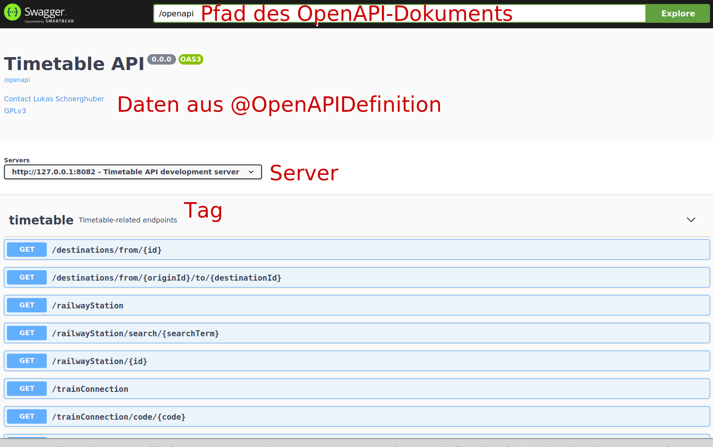

Als Nächstes möchten wir auf die Auswirkungen der Annotationen auf die JAX-RS-Handler eingehen.
Zur Illustration dient dazu die unten zu sehende Abbildung.
Wie zu sehen ist, ist für Parameter neben Beschreibung und Beispielwert angegeben, ob diese unbedingt erforderlich sind.
Ebenso sind die möglichen Response-Codes des APIs mitsamt Beschreibung, Beispielwert und Media-Type aufgeführt.

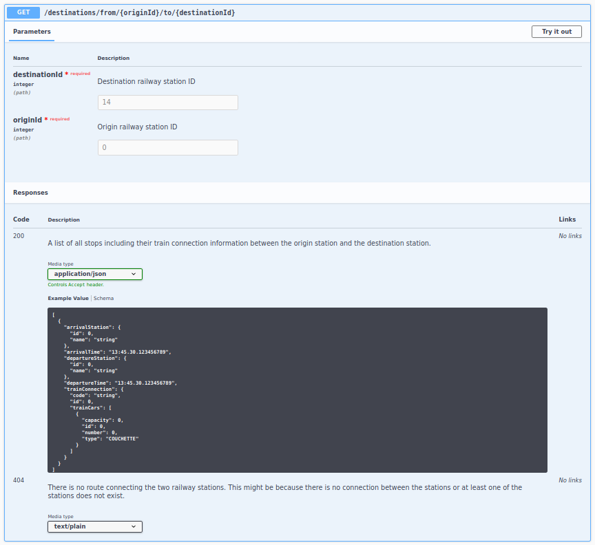

Natürlich kann das API auch direkt von Swagger UI ausprobiert werden, wie die folgende Abbildung zeigt, welche das Ergebnis der Abfrage einer Zugverbindung von Rom (Bahnhofs-ID 28) nach Zürich (Bahnhofs-ID 14) zeigt.

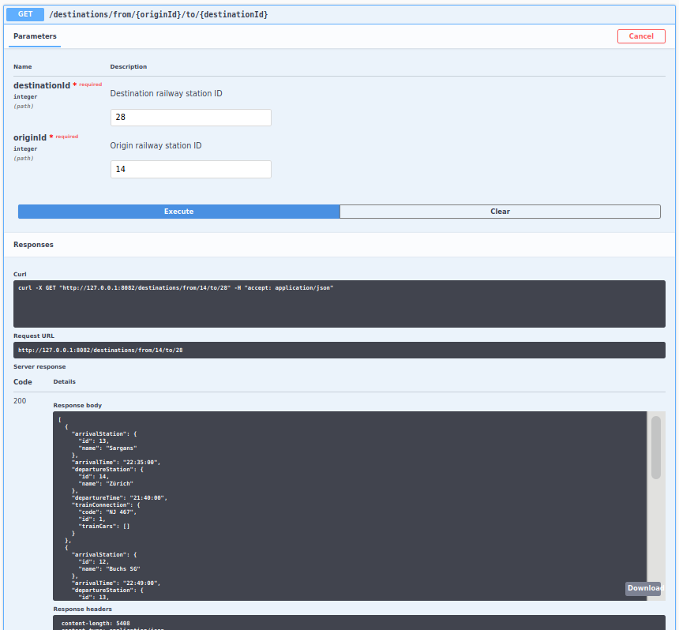

Ein weiteres Artefakt der Verwendung von MicroProfile OpenAPI ist der Client-Code für das React-basierte Frontend.
Das folgende Snippet zeigt den Aufruf der automatisch generierten Client-Methode zum Buchen eines Tickets.
Da es sich um TypeScript-Code handelt ist zur Compilezeit eine Typüberprüfung für sowohl den Body-Parameter als auch den Rückgabewert möglich, wodurch Fehler im Frontend-Code vermieden werden können.
Einzig der automatisch generierte Name (`apiBookingsPost`) der Methode ist unglücklich vom Client-Generator gewählt.
Hierfür bietet sich die Möglichkeit mittels der Annotation `@OperationId` oder über die Generatorkonfiguration einen besseren Namen auszuwählen.

```typescript
const bookingResponse = await this.props.bookingApi.apiBookingsPost({
	bookingRequestDto2: {
		originId: this.props.departureStationId,
		destinationId: this.props.arrivalStationId,
		trainCarType: this.state.trainCarType,
		journeyStartDate: this.state.departureDay
	}
});
```

# MicroProfile OpenTracing

## Beschreibung

Beim Einsatz von Microservice-Architekturen stellt sich das Problem des Debuggins und Troubleshootings über mehrerer Services verteilter Anwendungen.
OpenTracing stellt dabei ein standardisiertes, plattformunabhängiges API zur Instrumentarisierung von Microservices zur Verfügung.
Dabei können zusammenhängende Requests zwischen den Services über eine eindeutige Request-ID mittels grafischer Tools wie [Zipkin](https://zipkin.io/) oder [Jaeger](https://www.jaegertracing.io/) nachverfolgt werden.

MicroProfile OpenTracing ermöglicht es, Anwendungen ohne explizites Hinzufügen von Code um verteiltes Tracing zu erweitern.
Dabei werden Backends, welche das OpenTracing-Protokoll unterstützen, wie z.B. Jaeger unterstützt.

## Verwendung in Services

Bei Verwendung von MicroProfile OpenTracing werden laut Standard standardmäßig alle JAX-RS-Handler und MicroProfile Rest Client-Aufrufe um Tracing erweitert.
Wir haben darüber hinaus in beiden Services die Geschäftslogik und im Timetable-Service mittels einer Extension von Quarkus die JDBC-Aufrufe um Tracing erweitert.

## Implementierung

Der schwierigste Teil ist die Konfiguration des OpenTracing-Client.
Für Quarkus ist die [Dokumentation](https://quarkus.io/guides/opentracing#create-the-configuration) sehr gut und da man diese praktisch unverändert übernehmen kann, verweisen wir auf diese.
Für Wildfly beschreibt der [folgende Annoncement-Post](https://wildfly.org/news/2020/03/19/Micro_Profile_OpenTracing_Comes_To_WildFly/) die Verbindung zum Jaeger-Backend sehr gut.
Die Konfiguration für unsere Services ist ebenfalls im später folgenden Konfigurations-Abschnitt wiedergegeben.
Mit diesen Einstellungen werden bereits die JAX-RS-Endpoint-Aufrufe sowie die MicroProfile Rest Client-Aufrufe über Servicegrenzen getraced.

Ebenso kann mittels Annotationen festgelegt werden, dass Aufrufe einzelner Methoden oder aller Methoden einer Klasse getraced werden sollen.
Hierzu ist über die Klasse oder Metohde einfach die Annotation `@Traced` einzufügen.
Unsere Implementierung verwendet dies, um alle Aufrufe der Methoden der Geschäftslogikschicht zu verfolgen.
Unten folgt noch ein Beispiel eines solchen Tracing-Aufrufes.

```java
@RequestScoped
@Transactional
@Traced
public class RouteManagerCdi implements RouteManager {
	// ...
}
```

Um JDBC-Aufrufe nachverfolgen zu können, bietet Quarkus noch eine Erweiterung an.
Der erste Schritt zur Aktivierung dieser ist es, die Dependency zum entsprechenden JAR-File in die Datei `pom.xml` des Projektes einzutragen, wie das folgende Beispiel zeigt.

```xml
<dependencies>
	<dependency>
        <groupId>io.opentracing.contrib</groupId>
        <artifactId>opentracing-jdbc</artifactId>
    </dependency>
</dependencies>
```

Der JDBC-Tracer wrappt den JDBC-Treiber und augmentiert die Aufrufe um Tracing.
Daher müssen noch die Verbindungseinstellungen zur Datenbank überarbeitet werden:

1. Die URL des JDBC-Treibers muss um `:tracing` erweitert werden, sodass der Tracing-JDBC-Treiber aktiviert wird. Das folgende Beispiel zeigt die URL für die Timetable-Datenbank: `jdbc:tracing:postgresql://127.0.0.1:5432/timetable`
2. Der Tracing-Treiber muss explizit als JDBC-Treiber verwendet werden. Hierzu muss der Wert `io.opentracing.contrib.jdbc.TracingDriver` für den Schlüssel `quarkus.datasource.jdbc.driver` gesetzt werden.
3. Da nun der JDBC-Tracing-Treiber verwendet wird, muss der Dialekt für JPA noch gesetzt werden. Um diesen für PostgreSQL zu konfigurieren, ist für der Wert `org.hibernate.dialect.PostgreSQLDialect` für den Schlüssel `quarkus.hibernate-orm.dialect` zu setzen.

Das Jaeger-Tracing-Backend kann zu Entwicklungszwecken einfach mittels eines Docker-Containers betrieben werden, wozu das unten zu sehende Kommando auszuführen ist.

```bash
docker run -d --name jaeger -e COLLECTOR_ZIPKIN_HTTP_PORT=9411 -p 5775:5775/udp -p 6831:6831/udp -p 6832:6832/udp -p 5778:5778 -p 16686:16686 -p 14268:14268 -p 14250:14250 -p 9411:9411 --rm jaegertracing/all-in-one:1.17
```

## Ergebnisse

Von nun an sollten die Aufrufe der REST-Endpunkte, der Geschäftslogik und die JDBC-Aufrufe des Timetable-Service über die Jaeger-Web-UI nachverfolgbar sein.

In der Jaeger-UI sollten nun Traces für den Service angezeigt werden, wie die folgende Abbildung zeigt.

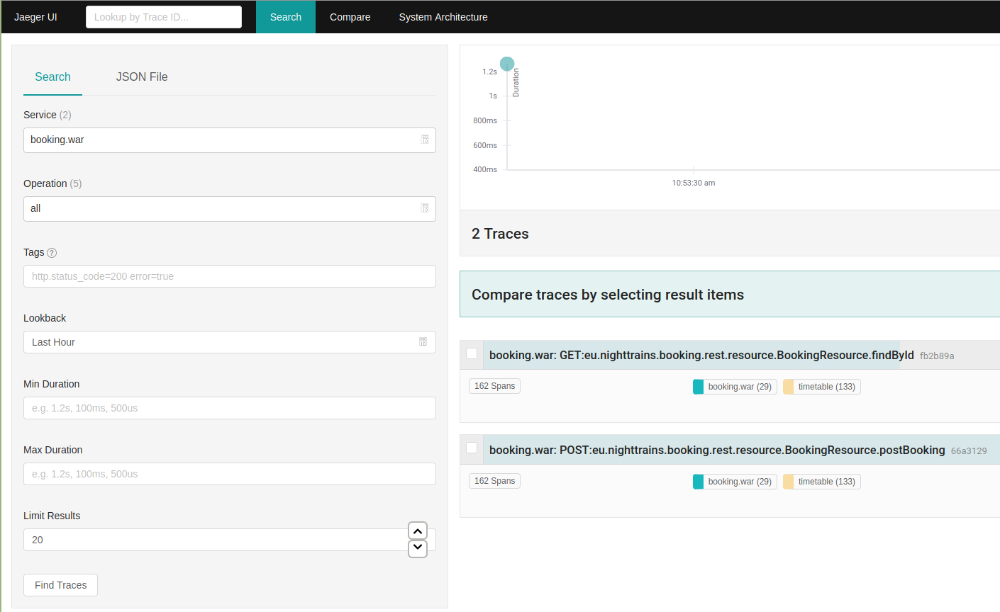

Nun kann man beispielsweise den oben zu sehenden Trace für die Methode `postBooking` auswählen und nun ergibt sich, wie in der folgenden Abbildung zu sehen ist, ein Bild über alle Methodenaufrufe, die bei der Abarbeitung des Requests ausgeführt werden.
Dies funktioniert auch über Servicegrenzen hinweg: So ist der Booking-Service blau eingefärbt, während der Timetable-Service gelb eingefärbt ist.
Ebenfalls zu sehen ist, dass die JAX-RS-Endpunkt-Aufrufe, die Geschäftslogikaufrufe und die MicroProfile Rest Client-Aufrufe des Booking-Service verfolgt werden.
Für den Timetable-Service werden ebenfalls die JAX-RS-Endpunkt-Aufrufe und die Geschäftslogikaufrufe sowie zusätzlich die JDBC-Aufrufe nachverfolgt.

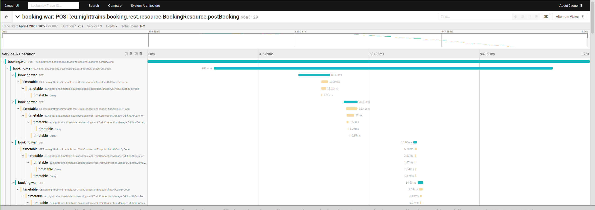

# Ergebnisse

Lukas & Alexander

## Frontend

Da das Frontend nicht Teil der Übungsaufgabe war, haben wir dies in dieser Dokumentation bisher kaum erwähnt.
Jedoch bietet es eine sehr gute Möglichkeit die funktionalen Ergebnisse unserer Ausarbeitung darzustellen.
Daher werden wir hier anhand des Frontend einen Überblick über die Funktionalität unserer Anwendung geben.

Unsere Anwendung verwendet das Package `react-router-dom` zur Strukturierung der einzelnen Komponenten sowie um die Browser-History komplett unterstützen zu können.
Die Startseite, welche unten zu sehen ist, bietet eine einfache Möglichkeit Verbindungen zwischen zwei Bahnhöfen zu suchen.
Wie ebenfalls in der Abbildung zu sehen ist, unterstützt die Anwendung ein einfaches Autocomplete für die Auswahl der Bahnhöfe.

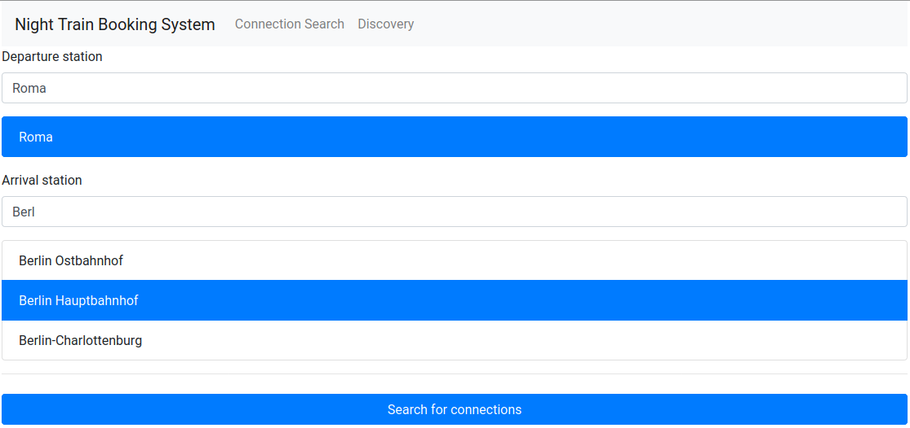

Nach dem Klick auf den Suchen-Button wird nach einer Verbindung gesucht und sofern eine gefunden wird, wird diese dem Kunden angezeigt, wie die unten zu sehende Abbildung verdeutlicht.

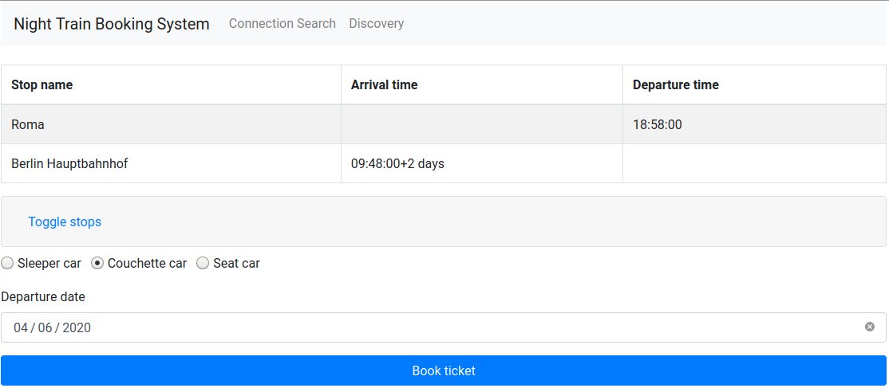

Durch Klick auf den Link-Button zum Anzeigen der Zwischenhalte, wird die Tabelle mit den Zwischenhalten expandiert, wie unten zu sehen ist.

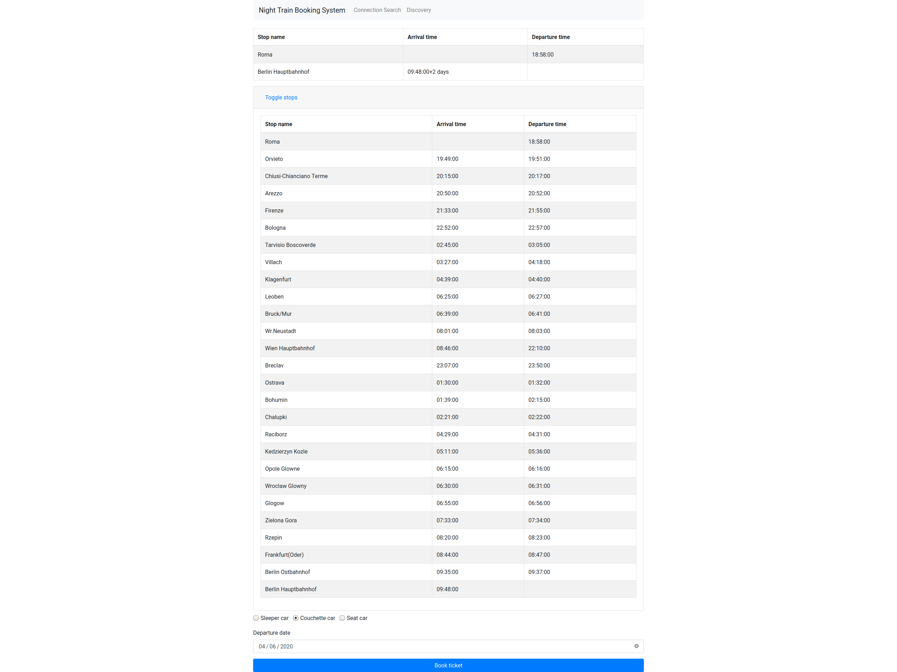

Alle Abfragen bisher sind vom Timetable-Service beantwortet worden.
Nach Selektion von Abfahrtsdatum und Wagenkategorie kann auf den Buchen-Button geklickt werden, was zur Folge hat, dass eine Anfrage an den Booking-Service gesendet.
Dieser versucht nun die Wagenkategorie für die gesamte Strecke zu buchen, wobei auch Umstiege berücksichtig werden.
Ein Umstieg wurde so modelliert, dass pro Umstieg ein zusätzliches Ticket erforderlich ist.
Auf der Strecke von Rom über Wien nach Berlin ist also ein Ticket von Rom nach Wien und ein Ticket von Wien nach Berlin erforderlich.

Nachdem die Buchung erfolgreich durchgeführt wurde, erfolgt eine Weiterleitung auf die Komponente zum Anzeigen der Buchung, wobei ein Beispiel unten zu sehen ist.
Für jede Buchung werden Abfahrts- und Zielbahnhof, Abfahrtsdatum und die einzelnen Tickets angezeigt.
Beim Klick auf ein Ticket werden Wagenkategorie, Wagennummer und alle Halte und Abfahrts- sowie Ankunftszeiten dargestellt.

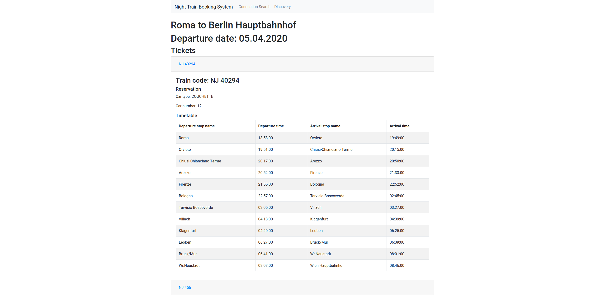

Abschließend zeigt die unten zu sehende Abbildung die Suche für den Entdeckungsmodus.
Hierfür muss lediglich ein Abfahrtsbahnhof eingegeben werden und nach Klick auf den Suchen-Button werden, wie in der zweiten folgenden Abbildung alle von diesem Bahnhof erreichbaren Ziele angezeigt.
Durch Klick auf den Link zum Finden einer Verbindung, wird auf die bereits bekannte Verbindungsanzeige weitergeleitet.

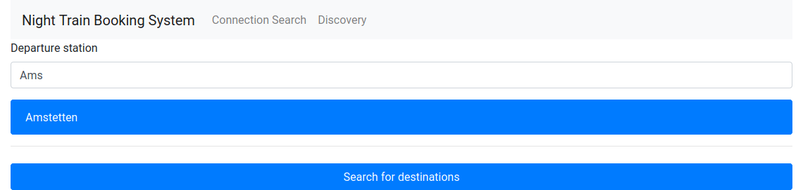
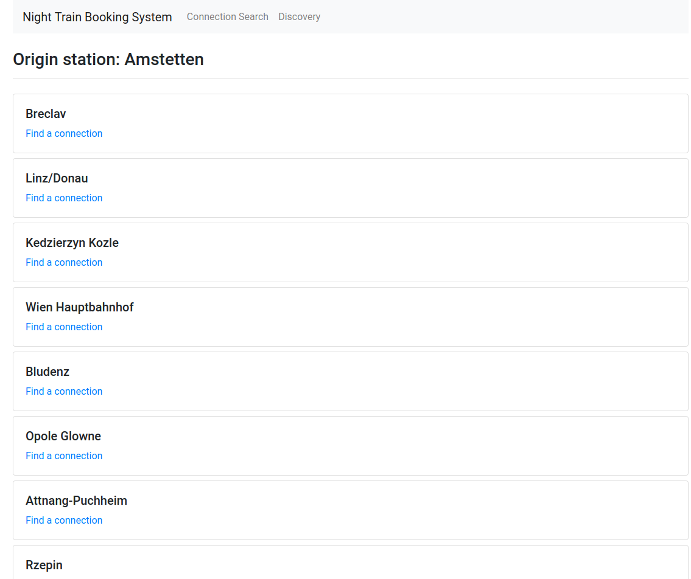

# Setup

Alexander

## Docker-Container

### PostgreSQL

### Jaeger

### Redis

## Timetable-Service

## Booking-Service

## Frontend
